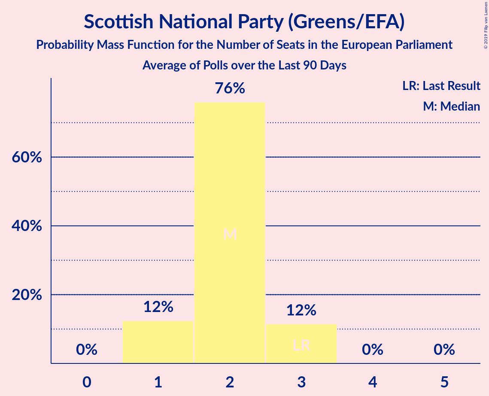

# Scottish National Party (Greens/EFA)

<a href="#voting-intentions">Voting Intentions</a> | <a href="#seats">Seats</a>

## Voting Intentions

Last result: **3.5%** (General Election of 23 May 2019)

### Confidence Intervals

| Period     | Polling firm/Commissioner(s) | Median | 80% Confidence Interval | 90% Confidence Interval | 95% Confidence Interval | 99% Confidence Interval |
|:----------:|:----------------:|:-----------:|:-----------------------:|:-----------------------:|:-----------------------:|:-----------------------:|
| N/A | [Poll Average](average.html) | 4.0% | 2.2–5.3% | 1.9–5.5% | 1.7–5.7% | 1.5–6.1% |
| [25–27 July 2019](2019-07-27-Deltapoll.html) | Deltapoll   The Mail on Sunday | 4.0% | 3.5–4.6% | 3.3–4.8% | 3.2–5.0% | 3.0–5.3% |
| [25–26 July 2019](2019-07-26-YouGov.html) | YouGov   The Sunday Times | 4.9% | 4.3–5.7% | 4.2–5.9% | 4.0–6.1% | 3.7–6.5% |
| [24–26 July 2019](2019-07-26-Opinium.html) | Opinium   The Observer | 4.9% | 4.3–5.6% | 4.2–5.8% | 4.0–5.9% | 3.8–6.3% |
| [24–25 July 2019](2019-07-25-ComRes.html) | ComRes   Sunday Express | 3.0% | 2.6–3.6% | 2.4–3.7% | 2.3–3.9% | 2.1–4.1% |
| [23–24 July 2019](2019-07-24-YouGov.html) | YouGov   The Times | 3.9% | 3.4–4.6% | 3.2–4.8% | 3.1–4.9% | 2.8–5.3% |
| [16–17 July 2019](2019-07-17-YouGov.html) | YouGov   The Times | 4.0% | 3.5–4.7% | 3.3–4.9% | 3.2–5.0% | 2.9–5.4% |
| [15–16 July 2019](2019-07-16-ComRes.html) | ComRes | 4.0% | 3.5–4.6% | 3.3–4.8% | 3.2–4.9% | 3.0–5.2% |
| [10–11 July 2019](2019-07-11-Survation.html) | Survation | 4.0% | 3.3–4.9% | 3.1–5.1% | 2.9–5.3% | 2.6–5.8% |
| [10–11 July 2019](2019-07-11-ComRes.html) | ComRes   The Express | 3.0% | 2.5–3.6% | 2.4–3.8% | 2.3–3.9% | 2.1–4.2% |
| [9–10 July 2019](2019-07-10-YouGov.html) | YouGov   The Times | 5.0% | 4.3–5.7% | 4.2–5.9% | 4.0–6.1% | 3.7–6.5% |
| [5–7 July 2019](2019-07-07-ComRes.html) | ComRes   Daily Telegraph | 3.0% | 2.6–3.6% | 2.5–3.7% | 2.4–3.9% | 2.2–4.2% |
| [3–5 July 2019](2019-07-05-Opinium.html) | Opinium   The Observer | 4.9% | 4.4–5.6% | 4.2–5.8% | 4.1–6.0% | 3.8–6.3% |
| [2–5 July 2019](2019-07-05-BMGResearch.html) | BMG Research   The Independent | 2.0% | 1.6–2.6% | 1.5–2.7% | 1.4–2.9% | 1.2–3.2% |
| [2–3 July 2019](2019-07-03-YouGov.html) | YouGov   The Times | 4.0% | 3.4–4.7% | 3.3–4.9% | 3.1–5.1% | 2.9–5.4% |
| [24–25 June 2019](2019-06-25-YouGov.html) | YouGov   The Times | 4.0% | 3.5–4.6% | 3.3–4.8% | 3.2–4.9% | 3.0–5.2% |
| [21–25 June 2019](2019-06-25-IpsosMORI.html) | Ipsos MORI | 4.0% | 3.3–4.9% | 3.2–5.2% | 3.0–5.4% | 2.7–5.9% |
| [19–20 June 2019](2019-06-20-Survation.html) | Survation   Daily Mail on Sunday | 3.0% | 2.5–3.5% | 2.4–3.7% | 2.3–3.8% | 2.1–4.1% |
| [19–20 June 2019](2019-06-20-Opinium.html) | Opinium   The Observer | 4.0% | 3.5–4.6% | 3.3–4.8% | 3.2–4.9% | 3.0–5.2% |
| [13–14 June 2019](2019-06-14-YouGov.html) | YouGov   The Sunday Times | 3.0% | 2.5–3.6% | 2.4–3.8% | 2.3–3.9% | 2.1–4.2% |
| [9–10 June 2019](2019-06-10-YouGov.html) | YouGov   The Times | 4.1% | 3.5–4.7% | 3.3–4.9% | 3.2–5.1% | 3.0–5.5% |
| [7–9 June 2019](2019-06-09-ComRes.html) | ComRes   Daily Telegraph | 3.0% | 2.5–3.5% | 2.4–3.7% | 2.3–3.8% | 2.1–4.1% |
| [4–7 June 2019](2019-06-07-BMGResearch.html) | BMG Research   The Independent | 0.0% | N/A | N/A | N/A | N/A |
| [4–6 June 2019](2019-06-06-YouGov.html) | YouGov   The Times | 5.0% | 4.3–5.7% | 4.1–5.9% | 4.0–6.1% | 3.7–6.5% |
| [28–30 May 2019](2019-05-30-Opinium.html) | Opinium   The Observer | 4.0% | 3.5–4.6% | 3.3–4.8% | 3.2–5.0% | 3.0–5.3% |
| [29–30 May 2019](2019-05-30-Deltapoll.html) | Deltapoll   The Mail on Sunday | 3.9% | 3.5–4.5% | 3.3–4.6% | 3.2–4.8% | 3.0–5.0% |
| [28–29 May 2019](2019-05-29-YouGov.html) | YouGov   The Times | 4.7% | 4.1–5.4% | 3.9–5.6% | 3.8–5.8% | 3.5–6.2% |

### Probability Mass Function

The following table shows the probability mass function per percentage block of voting intentions for the [poll average](average.html) for Scottish National Party (Greens/EFA).

| Voting Intentions | Probability | Accumulated | Special Marks |
|:-----------------:|:-----------:|:-----------:|:-------------:|
| 0.0–0.5% | 0% | 100% |  |
| 0.5–1.5% | 1.0% | 100% |  |
| 1.5–2.5% | 15% | 99.0% |  |
| 2.5–3.5% | 21% | 84% |  |
| 3.5–4.5% | 31% | 63% | Last Result, Median |
| 4.5–5.5% | 27% | 32% |  |
| 5.5–6.5% | 4% | 4% |  |
| 6.5–7.5% | 0.1% | 0.1% |  |
| 7.5–8.5% | 0% | 0% |  |

## Seats

Last result: **3** seats (General Election of 23 May 2019)

### Confidence Intervals

| Period     | Polling firm/Commissioner(s) | Median | 80% Confidence Interval | 90% Confidence Interval | 95% Confidence Interval | 99% Confidence Interval |
|:----------:|:----------------:|:------:|:-----------------------:|:-----------------------:|:-----------------------:|:-----------------------:|
| N/A | [Poll Average](average.html) | 3 | 2–3 | 1–3 | 1–4 | 1–4 |
| [25–27 July 2019](2019-07-27-Deltapoll.html) | Deltapoll   The Mail on Sunday | 3 | 2–3 | 2–3 | 2–3 | 2–3 |
| [25–26 July 2019](2019-07-26-YouGov.html) | YouGov   The Sunday Times | 3 | 3–4 | 3–4 | 3–4 | 2–4 |
| [24–26 July 2019](2019-07-26-Opinium.html) | Opinium   The Observer | 3 | 3 | 3 | 3 | 3 |
| [24–25 July 2019](2019-07-25-ComRes.html) | ComRes   Sunday Express | 2 | 2 | 2–3 | 2–3 | 1–3 |
| [23–24 July 2019](2019-07-24-YouGov.html) | YouGov   The Times | 3 | 2–3 | 2–3 | 2–3 | 2–3 |
| [16–17 July 2019](2019-07-17-YouGov.html) | YouGov   The Times | 3 | 2–3 | 2–3 | 2–3 | 2–4 |
| [15–16 July 2019](2019-07-16-ComRes.html) | ComRes | 3 | 2–3 | 2–3 | 2–3 | 2–3 |
| [10–11 July 2019](2019-07-11-Survation.html) | Survation | 3 | 2–3 | 2–3 | 2–3 | 2–4 |
| [10–11 July 2019](2019-07-11-ComRes.html) | ComRes   The Express | 3 | 2–3 | 2–3 | 2–3 | 2–3 |
| [9–10 July 2019](2019-07-10-YouGov.html) | YouGov   The Times | 4 | 3–4 | 3–4 | 3–4 | 3–4 |
| [5–7 July 2019](2019-07-07-ComRes.html) | ComRes   Daily Telegraph | 2 | 2–3 | 2–3 | 2–3 | 2–3 |
| [3–5 July 2019](2019-07-05-Opinium.html) | Opinium   The Observer | 3 | 3–4 | 3–4 | 3–4 | 3–4 |
| [2–5 July 2019](2019-07-05-BMGResearch.html) | BMG Research   The Independent | 1 | 1–2 | 1–2 | 1–2 | 1–2 |
| [2–3 July 2019](2019-07-03-YouGov.html) | YouGov   The Times | 3 | 3 | 2–3 | 2–3 | 2–4 |
| [24–25 June 2019](2019-06-25-YouGov.html) | YouGov   The Times | 3 | 2–3 | 2–3 | 2–3 | 2–4 |
| [21–25 June 2019](2019-06-25-IpsosMORI.html) | Ipsos MORI | 2 | 2–3 | 2–3 | 2–3 | 2–4 |
| [19–20 June 2019](2019-06-20-Survation.html) | Survation   Daily Mail on Sunday | 2 | 2–3 | 2–3 | 2–3 | 2–3 |
| [19–20 June 2019](2019-06-20-Opinium.html) | Opinium   The Observer | 3 | 3 | 3–4 | 2–4 | 2–4 |
| [13–14 June 2019](2019-06-14-YouGov.html) | YouGov   The Sunday Times | 2 | 2 | 2–3 | 2–3 | 1–3 |
| [9–10 June 2019](2019-06-10-YouGov.html) | YouGov   The Times | 3 | 3 | 2–4 | 2–4 | 2–4 |
| [7–9 June 2019](2019-06-09-ComRes.html) | ComRes   Daily Telegraph | 2 | 2–3 | 2–3 | 2–3 | 2–3 |
| [4–7 June 2019](2019-06-07-BMGResearch.html) | BMG Research   The Independent |  |  |  |  |  |
| [4–6 June 2019](2019-06-06-YouGov.html) | YouGov   The Times | 4 | 3–4 | 3–4 | 3–4 | 3–5 |
| [28–30 May 2019](2019-05-30-Opinium.html) | Opinium   The Observer | 3 | 3–4 | 3–4 | 3–4 | 2–4 |
| [29–30 May 2019](2019-05-30-Deltapoll.html) | Deltapoll   The Mail on Sunday | 3 | 3–4 | 3–4 | 3–4 | 2–4 |
| [28–29 May 2019](2019-05-29-YouGov.html) | YouGov   The Times | 3 | 3–4 | 3–4 | 3–4 | 3–4 |

### Probability Mass Function

The following table shows the probability mass function per seat for the [poll average](average.html) for Scottish National Party (Greens/EFA).

| Number of Seats | Probability | Accumulated | Special Marks |
|:---------------:|:-----------:|:-----------:|:-------------:|
| 1 | 10% | 100% |  |
| 2 | 32% | 90% |  |
| 3 | 55% | 59% | Last Result, Median |
| 4 | 3% | 3% |  |
| 5 | 0% | 0% |  |

