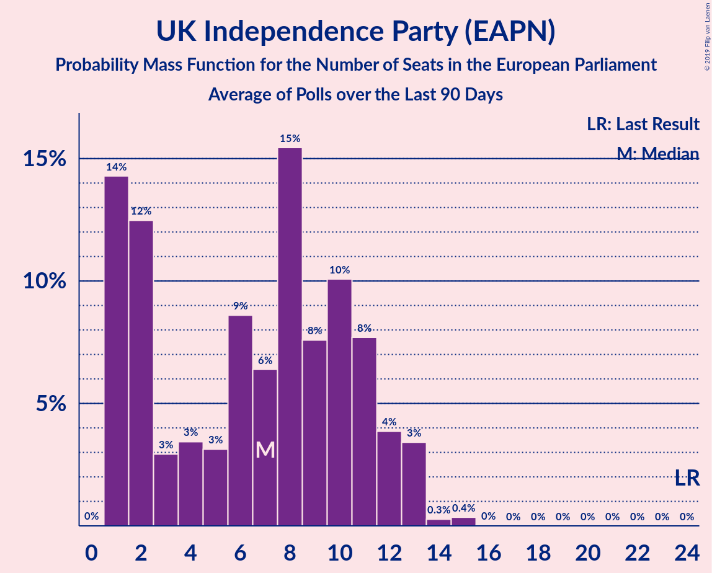

# UK Independence Party (EAPN)

<a href="#voting-intentions">Voting Intentions</a> | <a href="#seats">Seats</a>

## Voting Intentions

Last result: **26.6%** (General Election of 22 May 2014)

### Confidence Intervals

| Period     | Polling firm/Commissioner(s) | Median | 80% Confidence Interval | 90% Confidence Interval | 95% Confidence Interval | 99% Confidence Interval |
|:----------:|:----------------:|:-----------:|:-----------------------:|:-----------------------:|:-----------------------:|:-----------------------:|
| N/A | [Poll Average](average.html) | 5.1% | 3.1–7.4% | 2.7–7.7% | 2.5–7.9% | 2.1–8.4% |
| [29–30 April 2019](2019-04-30-YouGov.html) | YouGov | 4.0% | 3.4–4.7% | 3.3–4.9% | 3.1–5.1% | 2.9–5.4% |
| [23–26 April 2019](2019-04-26-YouGov.html) | YouGov   Hope Not Hate | 5.0% | 4.6–5.4% | 4.5–5.5% | 4.4–5.6% | 4.2–5.8% |
| [17–25 April 2019](2019-04-25-Survation.html) | Survation | 7.0% | 6.3–7.7% | 6.1–8.0% | 5.9–8.2% | 5.6–8.6% |
| [23–25 April 2019](2019-04-25-Opinium.html) | Opinium   The Observer | 3.0% | 2.4–3.8% | 2.3–4.1% | 2.1–4.3% | 1.9–4.7% |
| [23–24 April 2019](2019-04-24-YouGov.html) | YouGov | 5.0% | 4.6–5.4% | 4.5–5.5% | 4.5–5.6% | 4.3–5.8% |
| [16–17 April 2019](2019-04-17-YouGov.html) | YouGov   The Times | 6.0% | 5.3–6.8% | 5.1–7.0% | 5.0–7.2% | 4.7–7.6% |
| [15–16 April 2019](2019-04-16-YouGov.html) | YouGov   People’s Vote | 7.0% | 6.2–7.8% | 6.1–8.0% | 5.9–8.2% | 5.6–8.6% |
| [16 April 2019](2019-04-16-ComRes.html) | ComRes   Brexit Express | 5.0% | 4.2–6.0% | 4.0–6.2% | 3.8–6.5% | 3.5–7.0% |
| [9–12 April 2019](2019-04-12-Opinium.html) | Opinium   The Observer | 13.0% | 12.1–14.0% | 11.8–14.3% | 11.6–14.6% | 11.2–15.1% |
| [10–11 April 2019](2019-04-11-YouGov.html) | YouGov   The Times | 14.2% | 13.2–15.3% | 12.9–15.6% | 12.6–15.8% | 12.2–16.4% |
| [5–8 April 2019](2019-04-08-HanburyStrategy.html) | Hanbury Strategy   Open Europe | 7.0% | 6.4–7.8% | 6.2–8.1% | 6.0–8.3% | 5.7–8.7% |
| [28–30 March 2019](2019-03-30-Opinium.html) | Opinium   The Observer | 18.0% | 16.9–19.1% | 16.6–19.4% | 16.4–19.7% | 15.9–20.3% |
| [12–15 March 2019](2019-03-15-Opinium.html) | Opinium   The Observer | 16.8% | 15.8–18.0% | 15.5–18.3% | 15.3–18.5% | 14.8–19.1% |
| [10–17 January 2019](2019-01-17-NumberCruncherPolitics.html) | Number Cruncher Politics   Politico | 10.0% | 8.9–11.3% | 8.6–11.7% | 8.3–12.0% | 7.8–12.6% |

### Probability Mass Function

The following table shows the probability mass function per percentage block of voting intentions for the [poll average](average.html) for UK Independence Party (EAPN).

| Voting Intentions | Probability | Accumulated | Special Marks |
|:-----------------:|:-----------:|:-----------:|:-------------:|
| 0.5–1.5% | 0% | 100% |  |
| 1.5–2.5% | 3% | 100% |  |
| 2.5–3.5% | 16% | 97% |  |
| 3.5–4.5% | 22% | 81% |  |
| 4.5–5.5% | 14% | 59% | Median |
| 5.5–6.5% | 12% | 45% |  |
| 6.5–7.5% | 25% | 32% |  |
| 7.5–8.5% | 7% | 8% |  |
| 8.5–9.5% | 0.3% | 0.3% |  |
| 9.5–10.5% | 0% | 0% |  |
| 10.5–11.5% | 0% | 0% |  |
| 11.5–12.5% | 0% | 0% |  |
| 12.5–13.5% | 0% | 0% |  |
| 13.5–14.5% | 0% | 0% |  |
| 14.5–15.5% | 0% | 0% |  |
| 15.5–16.5% | 0% | 0% |  |
| 16.5–17.5% | 0% | 0% |  |
| 17.5–18.5% | 0% | 0% |  |
| 18.5–19.5% | 0% | 0% |  |
| 19.5–20.5% | 0% | 0% |  |
| 20.5–21.5% | 0% | 0% |  |
| 21.5–22.5% | 0% | 0% |  |
| 22.5–23.5% | 0% | 0% |  |
| 23.5–24.5% | 0% | 0% |  |
| 24.5–25.5% | 0% | 0% |  |
| 25.5–26.5% | 0% | 0% |  |
| 26.5–27.5% | 0% | 0% | Last Result |

## Seats

Last result: **24** seats (General Election of 22 May 2014)

### Confidence Intervals

| Period     | Polling firm/Commissioner(s) | Median | 80% Confidence Interval | 90% Confidence Interval | 95% Confidence Interval | 99% Confidence Interval |
|:----------:|:----------------:|:------:|:-----------------------:|:-----------------------:|:-----------------------:|:-----------------------:|
| N/A | [Poll Average](average.html) | 0 | 0–2 | 0–2 | 0–2 | 0–3 |
| [29–30 April 2019](2019-04-30-YouGov.html) | YouGov | 0 | 0 | 0 | 0 | 0 |
| [23–26 April 2019](2019-04-26-YouGov.html) | YouGov   Hope Not Hate |  |  |  |  |  |
| [17–25 April 2019](2019-04-25-Survation.html) | Survation | 1 | 1–2 | 1–2 | 0–3 | 0–4 |
| [23–25 April 2019](2019-04-25-Opinium.html) | Opinium   The Observer | 0 | 0 | 0 | 0 | 0 |
| [23–24 April 2019](2019-04-24-YouGov.html) | YouGov | 0 | 0 | 0 | 0 | 0 |
| [16–17 April 2019](2019-04-17-YouGov.html) | YouGov   The Times | 1 | 0–1 | 0–1 | 0–1 | 0–2 |
| [15–16 April 2019](2019-04-16-YouGov.html) | YouGov   People’s Vote | 2 | 1–3 | 1–3 | 1–3 | 0–4 |
| [16 April 2019](2019-04-16-ComRes.html) | ComRes   Brexit Express | 0 | 0–1 | 0–1 | 0–1 | 0–1 |
| [9–12 April 2019](2019-04-12-Opinium.html) | Opinium   The Observer | 9 | 8–11 | 7–11 | 7–12 | 7–13 |
| [10–11 April 2019](2019-04-11-YouGov.html) | YouGov   The Times | 10 | 8–13 | 8–13 | 8–14 | 8–15 |
| [5–8 April 2019](2019-04-08-HanburyStrategy.html) | Hanbury Strategy   Open Europe | 1 | 1–2 | 1–2 | 1–2 | 1–3 |
| [28–30 March 2019](2019-03-30-Opinium.html) | Opinium   The Observer | 15 | 12–16 | 11–16 | 11–17 | 10–17 |
| [12–15 March 2019](2019-03-15-Opinium.html) | Opinium   The Observer | 12 | 10–12 | 9–13 | 9–14 | 9–16 |
| [10–17 January 2019](2019-01-17-NumberCruncherPolitics.html) | Number Cruncher Politics   Politico | 6 | 3–7 | 2–7 | 2–7 | 2–7 |

### Probability Mass Function

The following table shows the probability mass function per seat for the [poll average](average.html) for UK Independence Party (EAPN).

| Number of Seats | Probability | Accumulated | Special Marks |
|:---------------:|:-----------:|:-----------:|:-------------:|
| 0 | 57% | 100% | Median |
| 1 | 29% | 43% |  |
| 2 | 14% | 14% |  |
| 3 | 0.7% | 0.9% |  |
| 4 | 0.2% | 0.2% |  |
| 5 | 0% | 0.1% |  |
| 6 | 0% | 0% |  |
| 7 | 0% | 0% |  |
| 8 | 0% | 0% |  |
| 9 | 0% | 0% |  |
| 10 | 0% | 0% |  |
| 11 | 0% | 0% |  |
| 12 | 0% | 0% |  |
| 13 | 0% | 0% |  |
| 14 | 0% | 0% |  |
| 15 | 0% | 0% |  |
| 16 | 0% | 0% |  |
| 17 | 0% | 0% |  |
| 18 | 0% | 0% |  |
| 19 | 0% | 0% |  |
| 20 | 0% | 0% |  |
| 21 | 0% | 0% |  |
| 22 | 0% | 0% |  |
| 23 | 0% | 0% |  |
| 24 | 0% | 0% | Last Result |

