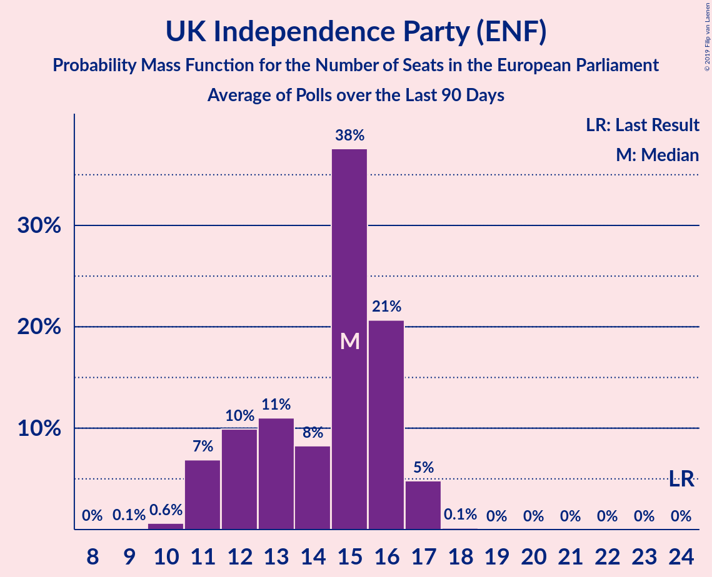

# UK Independence Party (ENF)

<a href="#voting-intentions">Voting Intentions</a> | <a href="#seats">Seats</a>

## Voting Intentions

Last result: **26.6%** (General Election of 22 May 2014)

### Confidence Intervals

| Period     | Polling firm/Commissioner(s) | Median | 80% Confidence Interval | 90% Confidence Interval | 95% Confidence Interval | 99% Confidence Interval |
|:----------:|:----------------:|:-----------:|:-----------------------:|:-----------------------:|:-----------------------:|:-----------------------:|
| N/A | [Poll Average](average.html) | 18.0% | 16.9–19.1% | 16.6–19.4% | 16.4–19.7% | 15.9–20.3% |
| [28–30 March 2019](2019-03-30-Opinium.html) | Opinium   The Observer | 18.0% | 16.9–19.1% | 16.6–19.4% | 16.4–19.7% | 15.9–20.3% |

### Probability Mass Function

The following table shows the probability mass function per percentage block of voting intentions for the [poll average](average.html) for UK Independence Party (ENF).

| Voting Intentions | Probability | Accumulated | Special Marks |
|:-----------------:|:-----------:|:-----------:|:-------------:|
| 13.5–14.5% | 0% | 100% |  |
| 14.5–15.5% | 0.1% | 100% |  |
| 15.5–16.5% | 4% | 99.9% |  |
| 16.5–17.5% | 25% | 96% |  |
| 17.5–18.5% | 44% | 70% | Median |
| 18.5–19.5% | 22% | 26% |  |
| 19.5–20.5% | 4% | 4% |  |
| 20.5–21.5% | 0.2% | 0.2% |  |
| 21.5–22.5% | 0% | 0% |  |
| 22.5–23.5% | 0% | 0% |  |
| 23.5–24.5% | 0% | 0% |  |
| 24.5–25.5% | 0% | 0% |  |
| 25.5–26.5% | 0% | 0% |  |
| 26.5–27.5% | 0% | 0% | Last Result |

## Seats

Last result: **24** seats (General Election of 22 May 2014)

### Confidence Intervals

| Period     | Polling firm/Commissioner(s) | Median | 80% Confidence Interval | 90% Confidence Interval | 95% Confidence Interval | 99% Confidence Interval |
|:----------:|:----------------:|:------:|:-----------------------:|:-----------------------:|:-----------------------:|:-----------------------:|
| N/A | [Poll Average](average.html) | 15 | 12–16 | 11–16 | 11–17 | 10–17 |
| [28–30 March 2019](2019-03-30-Opinium.html) | Opinium   The Observer | 15 | 12–16 | 11–16 | 11–17 | 10–17 |

### Probability Mass Function

The following table shows the probability mass function per seat for the [poll average](average.html) for UK Independence Party (ENF).

| Number of Seats | Probability | Accumulated | Special Marks |
|:---------------:|:-----------:|:-----------:|:-------------:|
| 9 | 0.1% | 100% |  |
| 10 | 0.6% | 99.9% |  |
| 11 | 7% | 99.2% |  |
| 12 | 10% | 92% |  |
| 13 | 11% | 82% |  |
| 14 | 8% | 71% |  |
| 15 | 38% | 63% | Median |
| 16 | 21% | 26% |  |
| 17 | 5% | 5% |  |
| 18 | 0.1% | 0.1% |  |
| 19 | 0% | 0% |  |
| 20 | 0% | 0% |  |
| 21 | 0% | 0% |  |
| 22 | 0% | 0% |  |
| 23 | 0% | 0% |  |
| 24 | 0% | 0% | Last Result |

