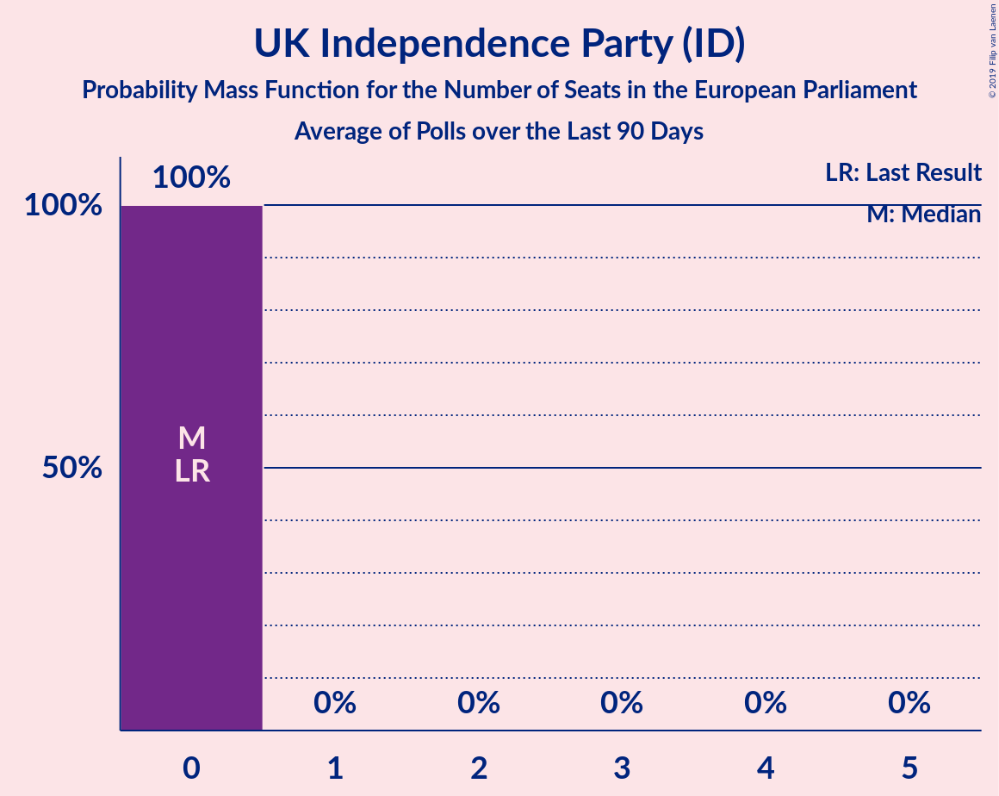

# UK Independence Party (ID)

<a href="#voting-intentions">Voting Intentions</a> | <a href="#seats">Seats</a>

## Voting Intentions

Last result: **3.2%** (General Election of 23 May 2019)

### Confidence Intervals

| Period     | Polling firm/Commissioner(s) | Median | 80% Confidence Interval | 90% Confidence Interval | 95% Confidence Interval | 99% Confidence Interval |
|:----------:|:----------------:|:-----------:|:-----------------------:|:-----------------------:|:-----------------------:|:-----------------------:|
| N/A | [Poll Average](average.html) | 1.1% | 0.8–2.1% | 0.7–2.3% | 0.6–2.5% | 0.5–2.9% |
| [6–11 August 2019](2019-08-11-Survation.html) | Survation | 0.0% | N/A | N/A | N/A | N/A |
| [9–11 August 2019](2019-08-11-ComRes.html) | ComRes   Daily Telegraph | 1.0% | N/A | N/A | N/A | N/A |
| [1–10 August 2019](2019-08-10-Opinium.html) | Opinium   Britain Elects | 1.0% | 0.7–1.6% | 0.6–1.7% | 0.6–1.9% | 0.5–2.1% |
| [5–6 August 2019](2019-08-06-YouGov.html) | YouGov   The Times | 0.2% | 0.1–0.5% | 0.1–0.6% | 0.1–0.6% | 0.1–0.8% |
| [29–30 July 2019](2019-07-30-YouGov.html) | YouGov   The Times | 1.0% | 0.8–1.4% | 0.7–1.5% | 0.7–1.6% | 0.6–1.7% |
| [26–30 July 2019](2019-07-30-IpsosMORI.html) | Ipsos MORI | 1.0% | 0.7–1.5% | 0.6–1.7% | 0.5–1.8% | 0.4–2.1% |
| [26–28 July 2019](2019-07-28-ComRes.html) | ComRes   Britain Elects | 0.0% | N/A | N/A | N/A | N/A |
| [25–27 July 2019](2019-07-27-Deltapoll.html) | Deltapoll   The Mail on Sunday | 1.0% | 0.8–1.4% | 0.7–1.5% | 0.6–1.5% | 0.5–1.7% |
| [25–26 July 2019](2019-07-26-YouGov.html) | YouGov   The Sunday Times | 0.2% | 0.1–0.5% | 0.1–0.5% | 0.1–0.6% | 0.1–0.7% |
| [24–26 July 2019](2019-07-26-Opinium.html) | Opinium   The Observer | 1.0% | 0.8–1.4% | 0.7–1.4% | 0.6–1.5% | 0.5–1.7% |
| [24–25 July 2019](2019-07-25-ComRes.html) | ComRes   Sunday Express | 1.0% | 0.7–1.3% | 0.7–1.4% | 0.6–1.5% | 0.5–1.7% |
| [23–24 July 2019](2019-07-24-YouGov.html) | YouGov   The Times | 1.0% | 0.7–1.4% | 0.7–1.5% | 0.6–1.6% | 0.5–1.8% |
| [16–17 July 2019](2019-07-17-YouGov.html) | YouGov   The Times | 0.2% | 0.1–0.5% | 0.1–0.5% | 0.1–0.6% | 0.1–0.7% |
| [15–16 July 2019](2019-07-16-ComRes.html) | ComRes | 1.0% | 0.7–1.3% | 0.7–1.4% | 0.6–1.5% | 0.5–1.7% |
| [10–11 July 2019](2019-07-11-Survation.html) | Survation | 0.0% | N/A | N/A | N/A | N/A |
| [10–11 July 2019](2019-07-11-ComRes.html) | ComRes   The Express | 1.0% | 0.8–1.4% | 0.7–1.5% | 0.6–1.6% | 0.5–1.8% |
| [9–10 July 2019](2019-07-10-YouGov.html) | YouGov   The Times | 0.2% | 0.1–0.5% | 0.1–0.5% | 0.1–0.6% | 0.1–0.8% |
| [5–7 July 2019](2019-07-07-ComRes.html) | ComRes   Daily Telegraph | 1.0% | 0.8–1.4% | 0.7–1.4% | 0.6–1.5% | 0.5–1.7% |
| [3–5 July 2019](2019-07-05-Opinium.html) | Opinium   The Observer | 1.0% | 0.7–1.3% | 0.7–1.4% | 0.6–1.5% | 0.5–1.7% |
| [2–5 July 2019](2019-07-05-BMGResearch.html) | BMG Research   The Independent | 2.0% | 1.6–2.6% | 1.5–2.7% | 1.4–2.9% | 1.2–3.2% |
| [2–3 July 2019](2019-07-03-YouGov.html) | YouGov   The Times | 0.2% | 0.1–0.5% | 0.1–0.6% | 0.1–0.6% | 0.1–0.8% |
| [24–25 June 2019](2019-06-25-YouGov.html) | YouGov   The Times | 1.0% | 0.8–1.4% | 0.7–1.5% | 0.7–1.6% | 0.6–1.8% |
| [21–25 June 2019](2019-06-25-IpsosMORI.html) | Ipsos MORI | 1.1% | 0.7–1.6% | 0.7–1.8% | 0.6–1.9% | 0.5–2.2% |
| [19–20 June 2019](2019-06-20-Survation.html) | Survation   Daily Mail on Sunday | 1.0% | 0.8–1.3% | 0.7–1.4% | 0.6–1.5% | 0.5–1.7% |
| [19–20 June 2019](2019-06-20-Opinium.html) | Opinium   The Observer | 2.0% | 1.6–2.5% | 1.5–2.6% | 1.5–2.7% | 1.3–2.9% |
| [13–14 June 2019](2019-06-14-YouGov.html) | YouGov   The Sunday Times | 0.2% | 0.1–0.5% | 0.1–0.5% | 0.1–0.6% | 0.1–0.8% |
| [9–10 June 2019](2019-06-10-YouGov.html) | YouGov   The Times | 0.2% | 0.1–0.5% | 0.1–0.5% | 0.1–0.6% | 0.1–0.7% |
| [7–9 June 2019](2019-06-09-ComRes.html) | ComRes   Daily Telegraph | 1.0% | 0.8–1.3% | 0.7–1.4% | 0.6–1.5% | 0.5–1.7% |
| [4–7 June 2019](2019-06-07-BMGResearch.html) | BMG Research   The Independent | 1.0% | 0.7–1.4% | 0.7–1.5% | 0.6–1.6% | 0.5–1.8% |
| [4–6 June 2019](2019-06-06-YouGov.html) | YouGov   The Times | 0.0% | N/A | N/A | N/A | N/A |
| [28–30 May 2019](2019-05-30-Opinium.html) | Opinium   The Observer | 1.0% | 0.8–1.4% | 0.7–1.4% | 0.6–1.5% | 0.5–1.7% |
| [29–30 May 2019](2019-05-30-Deltapoll.html) | Deltapoll   The Mail on Sunday | 1.0% | 0.8–1.3% | 0.7–1.4% | 0.7–1.5% | 0.6–1.6% |
| [28–29 May 2019](2019-05-29-YouGov.html) | YouGov   The Times | 1.0% | 0.8–1.4% | 0.7–1.5% | 0.6–1.6% | 0.5–1.8% |

### Probability Mass Function

The following table shows the probability mass function per percentage block of voting intentions for the [poll average](average.html) for UK Independence Party (ID).

| Voting Intentions | Probability | Accumulated | Special Marks |
|:-----------------:|:-----------:|:-----------:|:-------------:|
| 0.0–0.5% | 0.8% | 100% |  |
| 0.5–1.5% | 77% | 99.2% | Median |
| 1.5–2.5% | 20% | 22% |  |
| 2.5–3.5% | 2% | 2% | Last Result |
| 3.5–4.5% | 0% | 0% |  |

## Seats

Last result: **0** seats (General Election of 23 May 2019)

### Confidence Intervals

| Period     | Polling firm/Commissioner(s) | Median | 80% Confidence Interval | 90% Confidence Interval | 95% Confidence Interval | 99% Confidence Interval |
|:----------:|:----------------:|:------:|:-----------------------:|:-----------------------:|:-----------------------:|:-----------------------:|
| N/A | [Poll Average](average.html) | 0 | 0 | 0 | 0 | 0 |
| [6–11 August 2019](2019-08-11-Survation.html) | Survation |  |  |  |  |  |
| [9–11 August 2019](2019-08-11-ComRes.html) | ComRes   Daily Telegraph |  |  |  |  |  |
| [1–10 August 2019](2019-08-10-Opinium.html) | Opinium   Britain Elects | 0 | 0 | 0 | 0 | 0 |
| [5–6 August 2019](2019-08-06-YouGov.html) | YouGov   The Times | 0 | 0 | 0 | 0 | 0 |
| [29–30 July 2019](2019-07-30-YouGov.html) | YouGov   The Times | 0 | 0 | 0 | 0 | 0 |
| [26–30 July 2019](2019-07-30-IpsosMORI.html) | Ipsos MORI | 0 | 0 | 0 | 0 | 0 |
| [26–28 July 2019](2019-07-28-ComRes.html) | ComRes   Britain Elects |  |  |  |  |  |
| [25–27 July 2019](2019-07-27-Deltapoll.html) | Deltapoll   The Mail on Sunday | 0 | 0 | 0 | 0 | 0 |
| [25–26 July 2019](2019-07-26-YouGov.html) | YouGov   The Sunday Times | 0 | 0 | 0 | 0 | 0 |
| [24–26 July 2019](2019-07-26-Opinium.html) | Opinium   The Observer | 0 | 0 | 0 | 0 | 0 |
| [24–25 July 2019](2019-07-25-ComRes.html) | ComRes   Sunday Express | 0 | 0 | 0 | 0 | 0 |
| [23–24 July 2019](2019-07-24-YouGov.html) | YouGov   The Times | 0 | 0 | 0 | 0 | 0 |
| [16–17 July 2019](2019-07-17-YouGov.html) | YouGov   The Times | 0 | 0 | 0 | 0 | 0 |
| [15–16 July 2019](2019-07-16-ComRes.html) | ComRes | 0 | 0 | 0 | 0 | 0 |
| [10–11 July 2019](2019-07-11-Survation.html) | Survation |  |  |  |  |  |
| [10–11 July 2019](2019-07-11-ComRes.html) | ComRes   The Express | 0 | 0 | 0 | 0 | 0 |
| [9–10 July 2019](2019-07-10-YouGov.html) | YouGov   The Times | 0 | 0 | 0 | 0 | 0 |
| [5–7 July 2019](2019-07-07-ComRes.html) | ComRes   Daily Telegraph | 0 | 0 | 0 | 0 | 0 |
| [3–5 July 2019](2019-07-05-Opinium.html) | Opinium   The Observer | 0 | 0 | 0 | 0 | 0 |
| [2–5 July 2019](2019-07-05-BMGResearch.html) | BMG Research   The Independent | 0 | 0 | 0 | 0 | 0 |
| [2–3 July 2019](2019-07-03-YouGov.html) | YouGov   The Times | 0 | 0 | 0 | 0 | 0 |
| [24–25 June 2019](2019-06-25-YouGov.html) | YouGov   The Times | 0 | 0 | 0 | 0 | 0 |
| [21–25 June 2019](2019-06-25-IpsosMORI.html) | Ipsos MORI | 0 | 0 | 0 | 0 | 0 |
| [19–20 June 2019](2019-06-20-Survation.html) | Survation   Daily Mail on Sunday | 0 | 0 | 0 | 0 | 0 |
| [19–20 June 2019](2019-06-20-Opinium.html) | Opinium   The Observer | 0 | 0 | 0 | 0 | 0 |
| [13–14 June 2019](2019-06-14-YouGov.html) | YouGov   The Sunday Times | 0 | 0 | 0 | 0 | 0 |
| [9–10 June 2019](2019-06-10-YouGov.html) | YouGov   The Times | 0 | 0 | 0 | 0 | 0 |
| [7–9 June 2019](2019-06-09-ComRes.html) | ComRes   Daily Telegraph | 0 | 0 | 0 | 0 | 0 |
| [4–7 June 2019](2019-06-07-BMGResearch.html) | BMG Research   The Independent | 0 | 0 | 0 | 0 | 0 |
| [4–6 June 2019](2019-06-06-YouGov.html) | YouGov   The Times |  |  |  |  |  |
| [28–30 May 2019](2019-05-30-Opinium.html) | Opinium   The Observer | 0 | 0 | 0 | 0 | 0 |
| [29–30 May 2019](2019-05-30-Deltapoll.html) | Deltapoll   The Mail on Sunday | 0 | 0 | 0 | 0 | 0 |
| [28–29 May 2019](2019-05-29-YouGov.html) | YouGov   The Times | 0 | 0 | 0 | 0 | 0 |

### Probability Mass Function

The following table shows the probability mass function per seat for the [poll average](average.html) for UK Independence Party (ID).

| Number of Seats | Probability | Accumulated | Special Marks |
|:---------------:|:-----------:|:-----------:|:-------------:|
| 0 | 100% | 100% | Last Result, Median |

